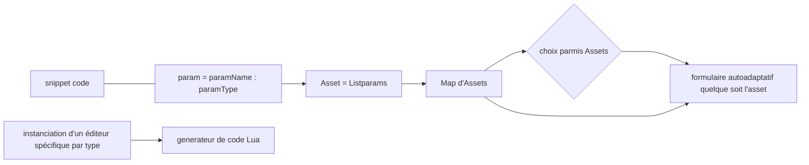

# FoundationModEditor
A été conçu pour le jeu de simulation Foundation de l'éditeur Polymorph Games.

A partir un fichier Snippet pour vsc donné pour l'autocomplétion du script lua necessaire à l'import d'assets
dans le moteur de "jeu Hurricane" cette application genere automatiquement les formulaires et les éditeurs pour générer
le code lua dans un bloc de texte.
Certains paramètres exigent l'ouverture d'un nouveau formulaire.
|     SOURCE     |           IHM                 |      SERVICE                |
|----------------|-------------------------------|-----------------------------|
|SNIPPETS        |   FORMULAIRES ET EDITEURS     | CODE LUA                    |

